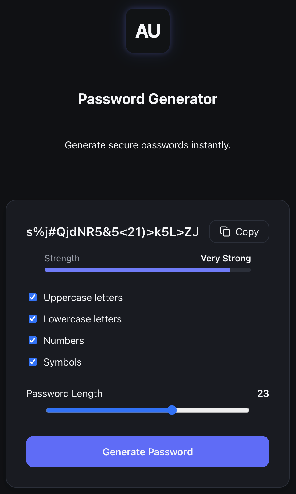

<p align="center">
  
</p>

<h1 align="center">
AU-RA Password Generator
</h1>

<p align="center">
Generate strong and secure passwords instantly with a clean, minimal and intuitive interface.
</p>

<p align="center">
  
</p>

---

## ✨ Features

- Generate secure random passwords
- Adjustable password length
- Include uppercase letters
- Include lowercase letters
- Include numbers
- Include symbols
- Real-time password strength indicator
- One-click copy to clipboard
- Responsive design

---

## 🛠️ Tech Stack

- React
- TypeScript
- Vite
- CSS Modules
- ESLint
- Prettier

---

## 🚀 Getting Started

Clone the repository

```bash
git clone https://github.com/mmycdev/aura-password-generator.git
```

Install dependencies

```bash
npm install
```

Run the development server

```bash
npm run dev
```

Build for production

```bash
npm run build
```

Run ESLint

```bash
npm run lint
```

Format the project

```bash
npm run format
```

---

## 📈 Roadmap

### Version 1.0.0

- [x] Password generation
- [x] Adjustable length
- [x] Character selection
- [x] Password strength indicator
- [x] Copy to clipboard
- [x] AU-RA branding

### Future

- [ ] Password history
- [ ] Theme switcher
- [ ] Keyboard shortcuts
- [ ] Advanced entropy analysis

---

## 📄 License

MIT